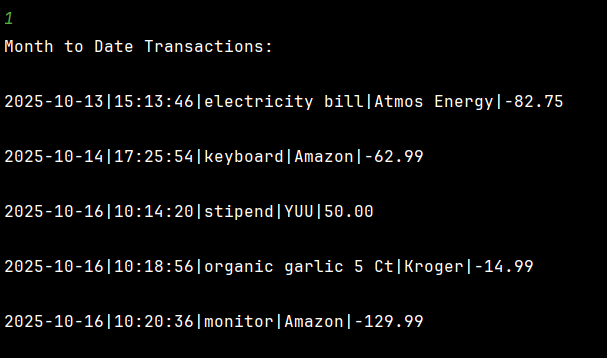

# Capstone 1: Accounting Ledger Application

## Project Overview
- Created a CLI (Command-Line-Interface) application that tracks all financial transactions where user is given multiple search options to view their transaction history.
- All transactions are saved to file transactions.csv in the following format:
  - date|time|description|vendor|amount

## Built with

## Features
(* = additional feature)
- Add deposit/make payment
- View different transaction history
  - Added custom search (filter)*
- Check current remaining account balance*

## Usage Display
- Home Screen:

- Add Deposit:

- Make Payment:

- Ledger Menu:

- Display All:

- Display Deposit:

- Display Payment:

- Display Balance:

- Reports Meu:

- Month to Date:

- Previous Month:

- Year to Date:

- Previous Year:

- Search by Vendor:

- Custom Search:
  - example 1:
  
  - example 2:

## Interesting Feature (code) Added:
- Added an extra feature to check user's account balance inside Ledger!

  
## Project Structure
- Home Screen (Main Entry Point)
  - Scanner for prompting users on selection
  - -switch statement inside while loop for home screen selection 
    - Add Deposit (save to csv file via BufferedWriter)
    - Make Payment 
    - Ledger Display (switch statement)
      - Display all entries
      - Display deposits
      - Display payments
      - Display balance
      - Reports (switch statement)
        - Month to Date
        - Previous Month
        - Year To Date
        - Previous Year
        - Search by Vendor
        -Custom Search (challenge option)
        - Back
      - Home
    - Exit
  - Methods for catching invalid user input

- Ledger
  - ArrayLists of Transaction Object
  - Add Deposit method
  - Make Payment method
  - Writing Transaction:
    - BufferedWriter (transaction.csv) under try/catch
  - Reading Transaction:
    - BufferedReader (reading from transaction.csv) under try/catch
  - Ledger methods
    - displayAll
    - displayDeposits
    - displayPayments
    - Methods for Reports search (case 1-5)
    - Custom Search Method (challenge)

- Transaction
    - Transaction field
    - Transaction constructor
    - getters/setters
    - toString method

## Testing/Bugfix History:
- deposit/payment methods were not recording in transaction.csv
  - fixed by loading transactions at start of HomeScreen
    - Ledger ledger = new Ledger();
      ledger.readTransaction()
  - fixed by adding ledger.writeTransaction(); in both case "D" and "P"
- display methods kept printing "no history available" exception
  - fixed by adding boolean to the methods
- added nonBlankInput and validNumber methods to HomeScreen to prevent invalid inputs from user
- loop issue with returning back to main menu from ledger menu
  - fixed by adding boolean ledgerMenu
- try/catch error in validNumber method for catching non-numeric inputs
  - fixed by adding scanner input into try/catch scope
- LocalDate parsing error for startDate/endDate in customSearch method
  - changed LocalDate and double to String inside the parameter and parsed it inside the method and in HomeScreen
- NullPointException / empty string error for double amount in customSearch method
  - originally changed double amount to a String inside customSearch parameter setting if .isBlank == null then parsing
  to double in both HomeScreen and inside filterAmount helper method which continued to give error
  - changed amount back to double from String in both helper method and customSearch constructor, took out parsing in
  helper method and instead set amountInput as String in HomeScreen, declared another double variable amountSearch 
  then assigned double amountSearch to parsed String amountInput inside if/else statement
- ConcurrentModificationException error for calling makePayment method in HomeScreen inside for-each loop looping over ledger.transactions
  - created a new boolean method in ledger class that checks if the user has sufficient amount
  - removed the for-each loop in payment section of HomeScreen and applied the boolean method in if/else statement instead